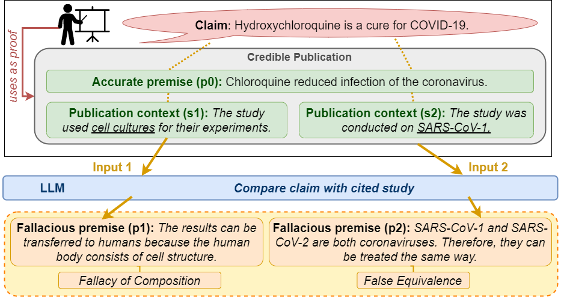

# <span style="font-variant:small-caps;">Missci</span>: Reconstructing the Fallacies in Misrepresented Science
[](https://opensource.org/licenses/Apache-2.0)
[](https://www.python.org/)


> **Abstract:** 
> Health-related misinformation on social networks can lead to poor decision-making and real-world dangers. Such misinformation often misrepresents scientific publications and cites them as "proof" to gain perceived credibility. To effectively counter such claims automatically, a system must explain how the claim was falsely derived from the cited publication. Current methods for automated fact-checking or fallacy detection neglect to assess the (mis)used evidence in relation to misinformation claims, which is required to detect the mismatch between them. To address this gap, we introduce <span style="font-variant:small-caps;">Missci</span>, a novel argumentation theoretical model for fallacious reasoning together with a new dataset for real-world misinformation detection that misrepresents biomedical publications. Unlike previous fallacy detection datasets, <span style="font-variant:small-caps;">Missci</span> (*i*) focuses on implicit fallacies between the relevant content of the cited publication and the inaccurate claim, and (*ii*) requires models to verbalize the fallacious reasoning in addition to classifying it. We present <span style="font-variant:small-caps;">Missci</span> as a dataset to test the critical reasoning abilities of large language models (LLMs), that are required to reconstruct real-world fallacious arguments, in a zero-shot setting. We evaluate two representative LLMs and the impact of different levels of detail about the fallacy classes provided to the LLM via prompts. Our experiments and human evaluation show promising results for GPT 4, while also demonstrating the difficulty of this task.

Contact person: [Max Glockner](mailto:max.glockner@tu-darmstadt.de) 

[UKP Lab](https://www.ukp.tu-darmstadt.de/) | [TU Darmstadt](https://www.tu-darmstadt.de/)

Don't hesitate to send us an e-mail or report an issue, if something is broken (and it shouldn't be) or if you have further questions.

# Setup
Follow these instructions to recreate thy python environment used for all our experiments. All experiments ran on A100 GPUs.

We use python version 3.10.
To create a python environment with all necessary dependencies run:
````shell
python -m venv missci
source missci/bin/activate
pip install -r requirements.txt
````

For Llama 2 / GPT 4 prompting edit the [llm-config.json](llm-config.json) file:
````json
{
  "gpt-4": {
      "AZURE_OPENAI_ENDPOINT": "<endpoint string>",
      "OPENAI_API_KEY": "<api key>"
  },
  "llama2": {
    "directory": "<llama2 directory>"
  }
}
````
# Structure
* The <span style="font-variant:small-caps;">Missci</span> dataset can be downloaded from the [dataset](dataset) directory.
* Our human evaluation and analysis results are provided in the [human-analysis](human-analysis) directory.
* Predictions will be stored in the [predictions](predictions) directory. For the different experiments separate subdirectories exist. The unparsed LLM outputs are stored in subdirectories named `<directory>-raw`:
  * For argument reconstruction: [predictions/generate-classify](predictions/generate-classify)
  * For LLM consistency results: [predictions/consistency](predictions/consistency)
  * For LLM classification of gold fallacious premises: [predictions/classify-given-gold-premise](predictions/predictions/classify-given-gold-premise)
  * For LLM classification without any fallacious premise: [predictions/only-classify](predictions/only-classify)
* Prompt templates are provided  in the [prompt-templates](prompt_templates) directory. It contains three subdirectories:
  * The prompts for argument reconstruction (premise generation and fallacy classification): [gen_cls](prompt_templates/gen_cls)
  * The prompts for fallacy classification based on a provided fallacious premise: [cls_with_premise](prompt_templates/cls_with_premise)
  * The prompts for fallacy classification without a provided fallacious premise: [cls_without_premise](prompt_templates/cls_without_premise)

# How to use

## Argument Reconstruction (Baselines)
Run `run-argument-reconstruction.py` to re-create the results for argument reconstruction with LLMs or the random baseline.

To run the baselines run
````shell
python run-argument-reconstruction.py eval-random claim
python run-argument-reconstruction.py eval-random p0
````
Baselines will randomly select a fallacy class and predict the `"claim"` or `"p0"` as the fallacious premise. If not specified otherwise, each baseline will run five times with the seeds `[1,2,3,4,5]`.
The predictions and evaluations will be stored in the [generate-classify](predictions/generate-classify) directory.


## Argument Reconstruction (LLM)
Prompts for argument reconstruction via LLMs are in the [gen_cls](prompt_templates/gen_cls) directory.
To prompt Llama2 or GPT 4 to reconstruct fallacious arguments run the `run-argument-reconstruction.py` script:
````bash
 python run-argument-reconstruction.py llama <prompt-template> <model-size> [<seed>] [--dev]
 python run-argument-reconstruction.py gpt4 <prompt-template> [--dev] [--overwrite]
````

To parse and evaluate the LLM output use:
````bash
 python run-argument-reconstruction.py parse-llm-output <file> <k> [--dev]
````

**Arguments:**

| Name                | Description                                                                       | Example                                        | 
|---------------------|-----------------------------------------------------------------------------------|------------------------------------------------|
| `<prompt-template>` | Path to the prompt template (relative to the "prompt_templates" directory)        | `gen_cls/p4-connect-D.txt`                     | 
| `<model-size>`      | Model size for Llama 2                                                            | One of (`"70b"`, `"13b"`, `"7b"`)              | 
| `<seed>`            | Optional random seed (default=`1`)                                                | `42`                                           |
| `<file>`            | Name (not path) of the file containing the raw LLM outputs for evaluation.        | `missci_gen_cls--p4-connect-D_70b__test.jsonl` |
| `<k>`               | For evaluation, consider the top *k* results.                                     | `1`                                            |
| `--dev`             | If set, only instances on the validation set are used (otherwise test instances). | `--dev`                                        | 
| `--overwrite`       | If set, existing GPT 4 predictions are not re-used but re-generated.              | `--overwrite`                                  | 

The LLM output will be stored in the [generate-classify-raw](predictions/generate-classify-raw) directory. 
The evaluation results and predictions will be stored in the [generate-classify](predictions/generate-classify) directory. 

**Example:**

To run LLMs using the **D**efinition prompt template run
````shell
 python run-argument-reconstruction.py llama gen_cls/p4-connect-D.txt 70b
 python run-argument-reconstruction.py gpt4 gen_cls/p4-connect-D.txt
````
And to evaluate the Llama2 output run:
````shell
 python run-argument-reconstruction.py parse-llm-output missci_gen_cls--p4-connect-D_70b__test.jsonl 1 
````


## Consistency
To measure the LLM consistency by prompting LLMs to re-classify the fallacy over their generated fallacious premises use the `un-get-consistency.py` file:

````shell
 python run-get-consistency.py llama <file> <prompt-template> <prefix> [--dev]
 python run-get-consistency.py gpt4 <file> <prompt-template> <prefix> [--dev] [--overwrite]
````
**Arguments:**

| Name                | Description                                                                       | Example                                        | 
|---------------------|-----------------------------------------------------------------------------------|------------------------------------------------|
| `<file>`            | Path to the input file within the "predictions/generate-classify" directory.      | `missci_gen_cls--p4-connect-D_70b__testk-1.jsonl`                     | 
| `<prompt-template>` | Path to the prompt template (relative to the "prompt_templates" directory)        | `cls_with_premise/classify-D.txt`                     | 
| `<prefix>`          | Prefix to be used when storing the results to avoid naming conflicts.             | ` _p4-D` |
| `--dev`             | If set, only instances on the validation set are used (otherwise test instances). | `--dev`                                        | 
| `--overwrite`       | If set, existing GPT 4 predictions are not re-used but re-generated.              | `--overwrite`                                  | 

**Example:**

To assess the consistency of Llama2 using the **D**efinition prompt template run:
````shell
 python run-get-consistency.py llama missci_gen_cls--p4-connect-D_70b__testk-1.jsonl cls_with_premise/classify-D.txt _p4-D
````

To parse and evaluate the resulting outputs run:
````shell
 python run-get-consistency.py consistency-parse  missci_p4-D_cls_with_premise--classify-D_70b__test.jsonl
````


## Fallacy classification (over gold premises)
To prompt LLMs to classify the fallacies over the provided gold fallacious premises run the `run-fallacy-classification-with-gold-premise.py` script:
````shell
 python run-fallacy-classification-with-gold-premise.py llama <prompt-template> <model-size> [<seed>] [--dev] 
 python run-fallacy-classification-with-gold-premise.py gpt4  <prompt-template> [--dev] [--overwrite]
````
A list of available prompts is provided in the [cls_with_premise](prompt_templates/cls_with_premise) directory.
Parse and evaluate with:

**Arguments**

| Name                | Description                                                                       | Example                                        | 
|---------------------|-----------------------------------------------------------------------------------|------------------------------------------------|
| `<prompt-template>` | Path to the prompt template (relative to the "prompt_templates" directory)        | `cls_with_premise/classify-D.txt`                     | 
| `<model-size>`          | Model size for Llama 2                                                            | One of (`"70b"`, `"13b"`, `"7b"`) |
| `<seed>`            | Optional random seed (default=`1`)                                                | `42`                                           |
| `--dev`             | If set, only instances on the validation set are used (otherwise test instances). | `--dev`                                        | 
| `--overwrite`       | If set, existing GPT 4 predictions are not re-used but re-generated.              | `--overwrite`                                  | 

**Example:**

To run Llama2 using the **D**efinition prompt template run:
````shell
 python run-fallacy-classification-with-gold-premise.py llama cls_with_premise/classify-D.txt 70b 
````
To parse and evaluate the results, run:
````shell
 python run-fallacy-classification-with-gold-premise.py parse-llm-output missci_cls_with_premise--classify-D_70b__test.jsonl 
````


## Fallacy classification (without premise)
To prompt LLMs to classify the fallacies without fallacious premises run the `run-fallacy-classification-without-premise.py` script:
````shell
 python run-fallacy-classification-without-premise.py llama <prompt-template> <model-size> [<seed>] [--dev]
 python run-fallacy-classification-without-premise.py gpt4  <prompt-template> [--dev] [--overwrite]
````
A list of available prompts is provided in the [cls_without_premise](cls_without_premise/cls_without_premise) directory.


**Arguments**

| Name                | Description                                                                       | Example                                       | 
|---------------------|-----------------------------------------------------------------------------------|-----------------------------------------------|
| `<prompt-template>` | Path to the prompt template (relative to the "prompt_templates" directory)        | `cls_without_premise/p4-connect-cls-D.txt`                     | 
| `<model-size>`          | Model size for Llama 2                                                            | One of (`"70b"`, `"13b"`, `"7b"`) |
| `<seed>`            | Optional random seed (default=`1`)                                                | `42`                                          |
| `--dev`             | If set, only instances on the validation set are used (otherwise test instances). | `--dev`                                       | 
| `--overwrite`       | If set, existing GPT 4 predictions are not re-used but re-generated.              | `--overwrite`                                 | 

**Example:**

To run Llama2 using the **D**efinition prompt template run:
````shell
 python run-fallacy-classification-without-premise.py llama cls_without_premise/p4-connect-cls-D.txt 70b
````
To parse and evaluate the results, run:
````shell
 python run-fallacy-classification-without-premise.py parse-llm-output missci_cls_without_premise--p4-connect-cls-D_70b__test.jsonl
````

# Citation
When using our dataset or code, please cite us with
```bibtex 
@article{glockner2024missci,
    title = "Missci: Reconstructing the Fallacies in Misrepresented Science",
    author = "Glockner, Max and Hou, Yufang and Nakov, Preslav and Gurevych, Iryna", 
    journal= "arXiv preprint TBA",
    year = "2024",
    url = "tba",
}
```
> This repository contains experimental software and is published for the sole purpose of giving additional background details on the respective publication. 
